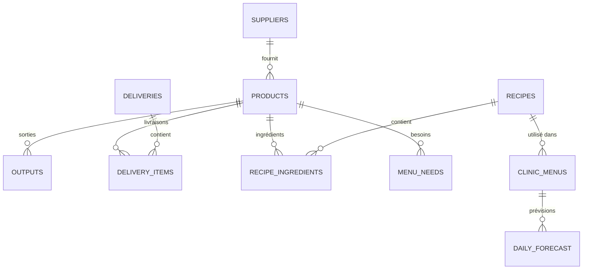

# StockPro - Schéma de Base de Données

## Vue d'ensemble

StockPro utilise **localStorage** comme système de stockage. Chaque collection est stockée sous une clé unique et contient un tableau d'objets JSON.



---

## Collections de Données

### 1. Products (Produits)
**Clé localStorage:** `stockpro_products`

| Champ | Type | Obligatoire | Description |
|-------|------|-------------|-------------|
| `id` | string | ✅ | Identifiant unique (format: `p_timestamp_random`) |
| `name` | string | ✅ | Nom du produit |
| `category` | string | ✅ | Catégorie (Légumes, Fruits, Viandes, etc.) |
| `unit` | string | ✅ | Unité de mesure (kg, L, pièce, etc.) |
| `quantity` | number | ✅ | Quantité en stock |
| `minStock` | number | ❌ | Seuil d'alerte stock minimum |
| `avgConsumption` | number | ❌ | Consommation moyenne par jour |
| `price` | number | ❌ | Prix unitaire en € |
| `createdAt` | ISO string | ✅ | Date de création |
| `lastUpdated` | ISO string | ✅ | Dernière modification |

**Exemple:**
```json
{
  "id": "p_1705493200000_abc123def",
  "name": "Tomates",
  "category": "Légumes",
  "unit": "kg",
  "quantity": 15,
  "minStock": 5,
  "avgConsumption": 2,
  "price": 3.50,
  "createdAt": "2024-01-17T10:00:00.000Z",
  "lastUpdated": "2024-01-17T14:30:00.000Z"
}
```

---

### 2. Outputs (Sorties)
**Clé localStorage:** `stockpro_outputs`

| Champ | Type | Obligatoire | Description |
|-------|------|-------------|-------------|
| `id` | string | ✅ | Identifiant unique (format: `o_timestamp_random`) |
| `productId` | string | ✅ | Référence vers Products.id |
| `quantity` | number | ✅ | Quantité sortie |
| `reason` | string | ❌ | Motif (Service midi, Perte, etc.) |
| `date` | YYYY-MM-DD | ✅ | Date de la sortie |
| `createdAt` | ISO string | ✅ | Horodatage |

**Exemple:**
```json
{
  "id": "o_1705493200000_xyz789",
  "productId": "p_1705493200000_abc123def",
  "quantity": 2,
  "reason": "Service midi",
  "date": "2024-01-17",
  "createdAt": "2024-01-17T12:00:00.000Z"
}
```

---

### 3. Deliveries (Livraisons)
**Clé localStorage:** `stockpro_deliveries`

| Champ | Type | Obligatoire | Description |
|-------|------|-------------|-------------|
| `id` | string | ✅ | Identifiant unique (format: `d_timestamp_random`) |
| `date` | YYYY-MM-DD | ✅ | Date de livraison |
| `supplier` | string | ✅ | Nom du fournisseur |
| `items` | array | ✅ | Liste des articles livrés |
| `photo` | base64 string | ❌ | Photo du bon de livraison |
| `total` | number | ❌ | Montant total en € |
| `createdAt` | ISO string | ✅ | Horodatage |

**Structure `items[]`:**
```json
{
  "productId": "p_xxx",
  "quantity": 10,
  "unitPrice": 2.50
}
```

---

### 4. Photos
**Clé localStorage:** `stockpro_photos`

| Champ | Type | Obligatoire | Description |
|-------|------|-------------|-------------|
| `id` | string | ✅ | Identifiant unique (format: `ph_timestamp_random`) |
| `data` | base64 string | ✅ | Image compressée en base64 |
| `type` | string | ✅ | Type: stock, delivery, recipe, inventory |
| `description` | string | ❌ | Description |
| `createdAt` | ISO string | ✅ | Horodatage |

---

### 5. Menus (Planning hebdomadaire - legacy)
**Clé localStorage:** `stockpro_menus`

| Champ | Type | Obligatoire | Description |
|-------|------|-------------|-------------|
| `id` | string | ✅ | Identifiant unique (format: `m_timestamp`) |
| `weekNumber` | number | ✅ | Numéro de semaine (1-52) |
| `year` | number | ✅ | Année |
| `days` | object | ✅ | Planning par jour |

---

### 6. Suppliers (Fournisseurs)
**Clé localStorage:** `stockpro_suppliers`

| Champ | Type | Obligatoire | Description |
|-------|------|-------------|-------------|
| `id` | string | ✅ | Identifiant unique (format: `sup_timestamp_random`) |
| `name` | string | ✅ | Nom du fournisseur |
| `category` | string | ❌ | ID catégorie (fruits-legumes, viandes, etc.) |
| `phone` | string | ❌ | Téléphone |
| `email` | string | ❌ | Email |
| `address` | string | ❌ | Adresse |
| `orderDays` | array | ❌ | Jours de commande (["lundi", "jeudi"]) |
| `deliveryDays` | array | ❌ | Jours de livraison |
| `minOrder` | number | ❌ | Commande minimum en € |
| `notes` | string | ❌ | Notes |
| `productIds` | array | ❌ | IDs des produits fournis |
| `logoUrl` | base64 string | ❌ | Logo du fournisseur |
| `createdAt` | ISO string | ✅ | Date création |
| `updatedAt` | ISO string | ❌ | Dernière modification |

**Catégories disponibles:**
- `fruits-legumes`, `viandes`, `poissons`, `produits-laitiers`, `epicerie`
- `boulangerie`, `boissons`, `surgeles`, `hygiene`, `materiel`, `autre`

---

### 7. Recipes (Recettes)
**Clé localStorage:** `stockpro_recipes`

| Champ | Type | Obligatoire | Description |
|-------|------|-------------|-------------|
| `id` | string | ✅ | Identifiant unique (format: `rec_timestamp_random`) |
| `name` | string | ✅ | Nom de la recette |
| `portions` | number | ✅ | Nombre de portions |
| `ingredients` | array | ✅ | Liste des ingrédients |
| `dietaryTags` | array | ❌ | Tags régime (sans-sel, mixe, etc.) |
| `photo` | base64 string | ❌ | Photo de la recette |
| `instructions` | string | ❌ | Instructions de préparation |
| `createdAt` | ISO string | ✅ | Date création |
| `updatedAt` | ISO string | ❌ | Dernière modification |

**Structure `ingredients[]`:**
```json
{
  "productId": "p_xxx",
  "quantity": 0.5
}
```

**Tags régime disponibles:**
- `normal`, `sans-sel`, `mixe`, `hache`, `diabetique`
- `sans-gluten`, `vegetarien`, `sans-lactose`

---

### 8. ClinicMenus (Menus Clinique)
**Clé localStorage:** `stockpro_clinic_menus`

| Champ | Type | Obligatoire | Description |
|-------|------|-------------|-------------|
| `id` | string | ✅ | Identifiant unique (format: `cm_timestamp`) |
| `date` | YYYY-MM-DD | ✅ | Date du menu |
| `patientLunch` | object | ❌ | Déjeuner patients |
| `patientDinner` | object | ❌ | Dîner patients |
| `staffLunch` | object | ❌ | Déjeuner personnel |
| `punctualOrders` | array | ❌ | Commandes ponctuelles |
| `notes` | string | ❌ | Notes du jour |
| `forecast` | object | ❌ | Prévisions de couverts |

**Structure repas (patientLunch, etc.):**
```json
{
  "recipeId": "rec_xxx",
  "portions": 50
}
```

**Structure `forecast`:**
```json
{
  "patients": 45,
  "staff": 12
}
```

---

### 9. DailyForecast (Prévisions)
**Clé localStorage:** `stockpro_forecasts`

| Champ | Type | Obligatoire | Description |
|-------|------|-------------|-------------|
| `id` | string | ✅ | Identifiant unique |
| `date` | YYYY-MM-DD | ✅ | Date |
| `patients` | number | ✅ | Nombre patients prévus |
| `staff` | number | ✅ | Nombre personnel prévu |
| `notes` | string | ❌ | Notes |

---

## Relations entre Collections

```
┌─────────────────┐
│    PRODUCTS     │
│  (stock items)  │
└────────┬────────┘
         │
    ┌────┼────────────────────────────────┐
    │    │                                │
    ▼    ▼                                ▼
┌────────┴───────┐  ┌────────────┐  ┌─────────────────┐
│    OUTPUTS     │  │ DELIVERIES │  │     RECIPES     │
│   (sorties)    │  │(livraisons)│  │   (recettes)    │
└────────────────┘  └─────┬──────┘  └────────┬────────┘
                          │                   │
                    items[]              ingredients[]
                          │                   │
                          ▼                   ▼
                   ┌──────────────────────────────────┐
                   │          CLINIC_MENUS            │
                   │    (menus clinique/jour)         │
                   └──────────────────────────────────┘
                                  │
                                  ▼
                   ┌──────────────────────────────────┐
                   │         DAILY_FORECAST           │
                   │      (prévisions couverts)       │
                   └──────────────────────────────────┘

┌─────────────────┐     ┌─────────────────┐
│    SUPPLIERS    │     │     PHOTOS      │
│  (fournisseurs) │     │   (galerie)     │
└─────────────────┘     └─────────────────┘
```

---

## Génération des IDs

Format des IDs: `{prefix}_{timestamp}_{random}`

| Collection | Préfixe | Exemple |
|------------|---------|---------|
| Products | `p_` | `p_1705493200000_abc123def` |
| Outputs | `o_` | `o_1705493200000_xyz789` |
| Deliveries | `d_` | `d_1705493200000_def456` |
| Photos | `ph_` | `ph_1705493200000_ghi012` |
| Menus | `m_` | `m_1705493200000` |
| Suppliers | `sup_` | `sup_1705493200000_jkl345` |
| Recipes | `rec_` | `rec_1705493200000_mno678` |
| ClinicMenus | `cm_` | `cm_1705493200000` |

---

## Export/Import

L'application supporte l'export/import complet des données via:
- **JSON** : Export/Import de toutes les collections
- **Excel** : Export pour visualisation externe

Structure du fichier JSON exporté:
```json
{
  "products": [...],
  "outputs": [...],
  "deliveries": [...],
  "photos": [...],
  "menus": [...],
  "exportDate": "2024-01-17T12:00:00.000Z"
}
```
